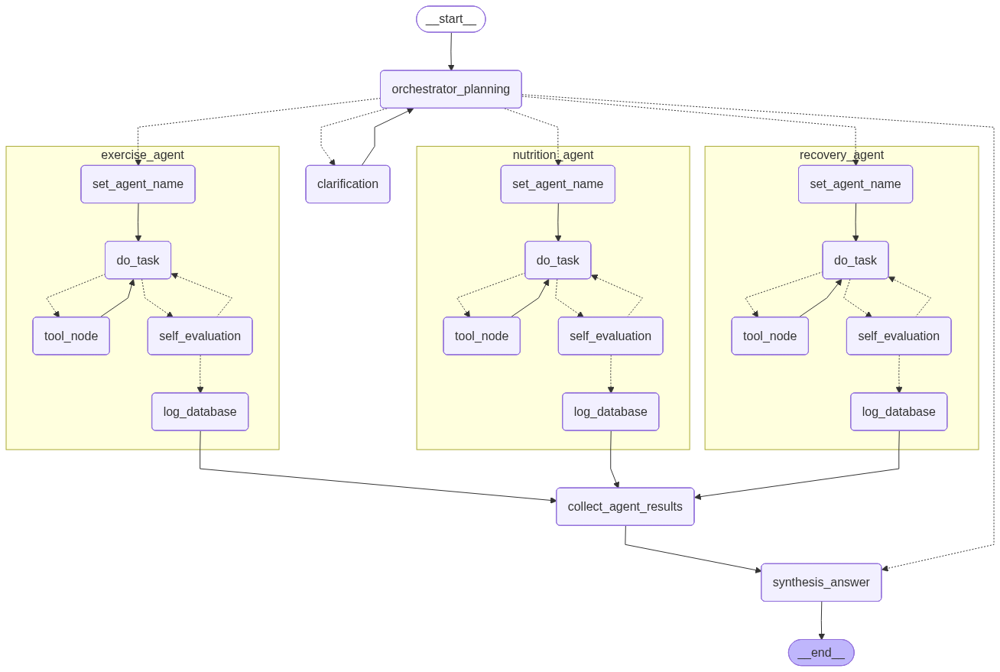

# HealthPilot

An AI-powered personal health assistant that tracks nutrition, exercise, and sleep — personalized to your long-term goals over time.

Built as a production-style multi-agent system using LangGraph, FastAPI, and a three-layer memory architecture.

---

## Overview

HealthPilot routes user queries through a multi-agent pipeline. An orchestrator agent interprets the user's intent, delegates tasks to specialized agents in parallel, and synthesizes a unified response — all grounded in the user's health history and active goals.

**Specialized agents:**
- **Nutrition Agent** — logs meals, calculates macros, gives dietary advice
- **Exercise Agent** — logs workouts, advises on training programming
- **Recovery Agent** — logs sleep, tracks HRV and recovery metrics

Each agent operates in a self-evaluation loop: it produces an output, a QA reviewer validates it against schema and biological plausibility, and the agent corrects and retries if rejected before writing to the database.

---

## Architecture

```
POST /api/v1/chat
        │
        └─ LangGraph graph.invoke(GlobalState)
                │
                ├─ orchestrator_planning
                │       ├─ (clarification needed) → clarification ⇄ [interrupt / user input]
                │       │                                └─ orchestrator_planning (re-plan)
                │       │
                │       └─ (tasks assigned) → [agent subgraphs run in parallel]
                │                   set_agent_name → do_task ⇄ tool_node
                │                                       ↓
                │                                self_evaluation
                │                                ├─ rejected → do_task (retry)
                │                                └─ approved → log_database
                │
                ├─ collect_agent_results
                └─ synthesis_answer
```



### Memory Layers

| Layer | Technology | Purpose | TTL |
|-------|------------|---------|-----|
| Short-term | Redis sorted sets | 24h conversation history | 24h auto-prune |
| Structured long-term | PostgreSQL | Nutrition, workout, sleep records; user profile | Permanent |
| Semantic long-term | ChromaDB | Preferences, patterns, notable events | Permanent |

---

## Tech Stack

- **Orchestration** — [LangGraph](https://github.com/langchain-ai/langgraph)
- **LLM** — OpenAI GPT (structured output via Pydantic)
- **API** — FastAPI
- **Databases** — PostgreSQL, Redis, ChromaDB
- **Infrastructure** — Docker Compose
- **Web Search** — Tavily API

---

## Getting Started

### Prerequisites

- Docker & Docker Compose
- Python 3.11+
- OpenAI API key
- Tavily API key

### 1. Clone the repo

```bash
git clone https://github.com/your-username/healthpilot.git
cd healthpilot
```

### 2. Configure environment

```bash
cp .env.example .env
# Fill in your API keys and credentials
```

### 3. Start services

```bash
docker compose up -d
```

### 4. Install dependencies

```bash
pip install -r requirements.txt
```

### 5. Run the API

```bash
uvicorn api.main:app --reload
```

The API will be available at `http://localhost:8000`. Interactive docs at `http://localhost:8000/docs`.

---

## Running Tests

```bash
# All tests
pytest

# Unit tests only (no external services required)
pytest tests/ -v
```

Unit tests use `fakeredis` and mocked LLMs. Integration tests require live PostgreSQL, Redis, and ChromaDB instances.

---

## Project Structure

```
├── agents/
│   ├── orchestrator.py          # Planning, result collection, synthesis
│   └── specialized_agent/       # Nutrition, Exercise, Recovery agents + base class
├── api/
│   ├── main.py                  # FastAPI app + lifespan
│   └── routes.py                # /chat and /chat/resume endpoints
├── core/
│   ├── graph.py                 # LangGraph graph construction
│   ├── state.py                 # GlobalState, AgentState, reducers
│   └── config.py                # Settings from .env
├── tools/
│   └── memory_service.py        # UnifiedMemoryManager (Redis + SQL + Chroma)
├── utils/prompts/               # Jinja2 prompt templates per agent
├── tests/                       # Unit and integration tests
└── docker-compose.yml           # PostgreSQL, Redis, ChromaDB
```